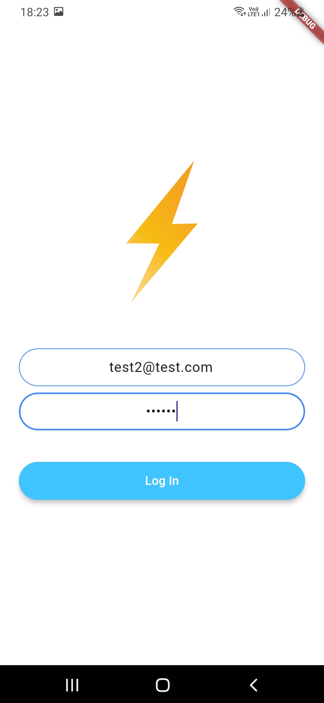
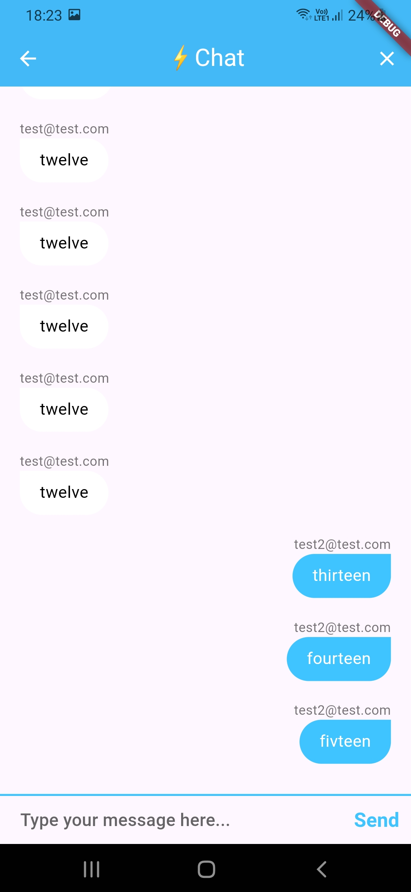

## Flash Chat

A Simple chat app build with firebase and flutter.





> Steps to run

- Add firebase configuration as mentioned in docs for flutter

```bash
flutter pub get
```

```bash
flutter run
```

<br />

> Things Learned

- How to integrate firebase to flutter
- Handle authentication with flutter
- Store data to firestore database
- Streams in flutter